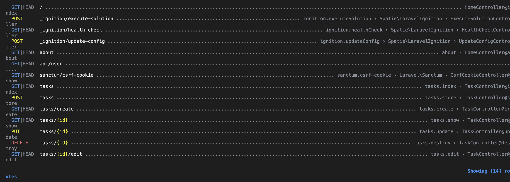
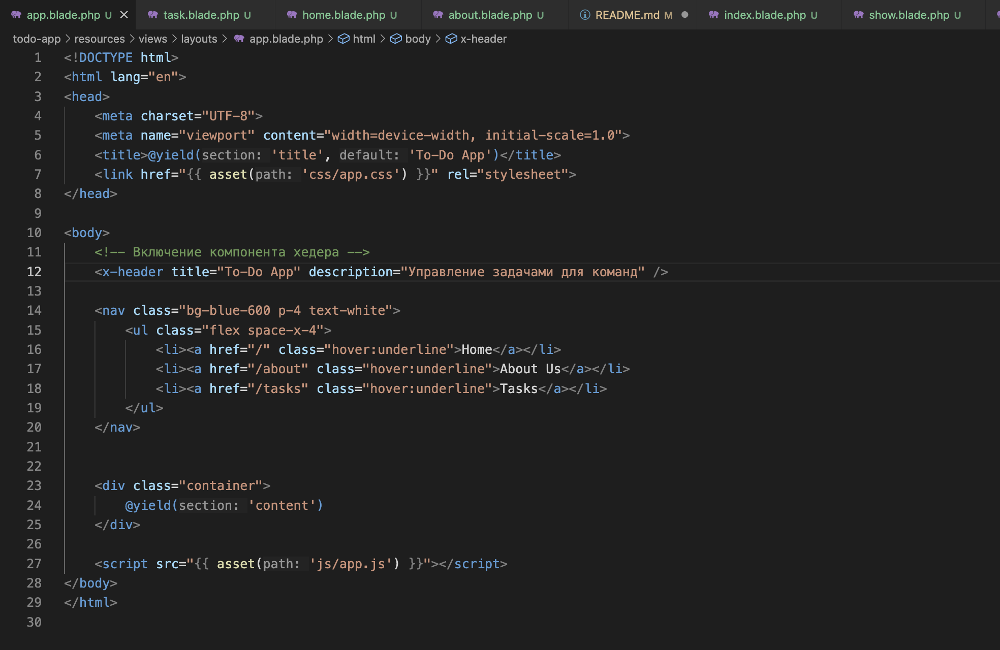
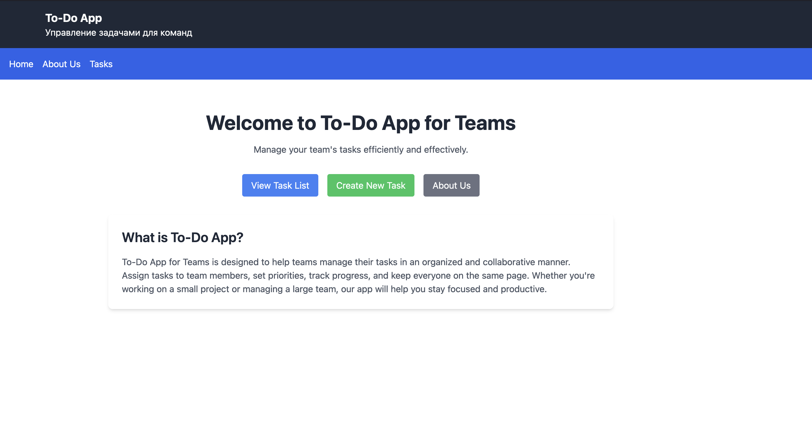
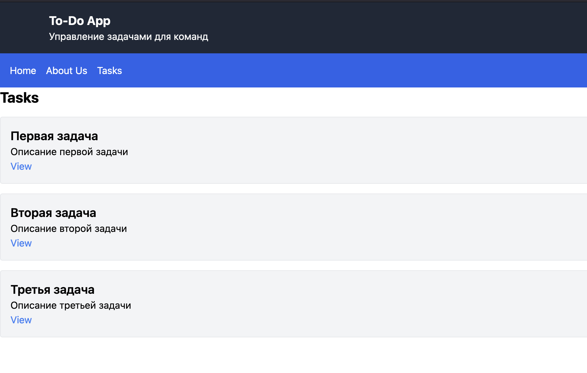
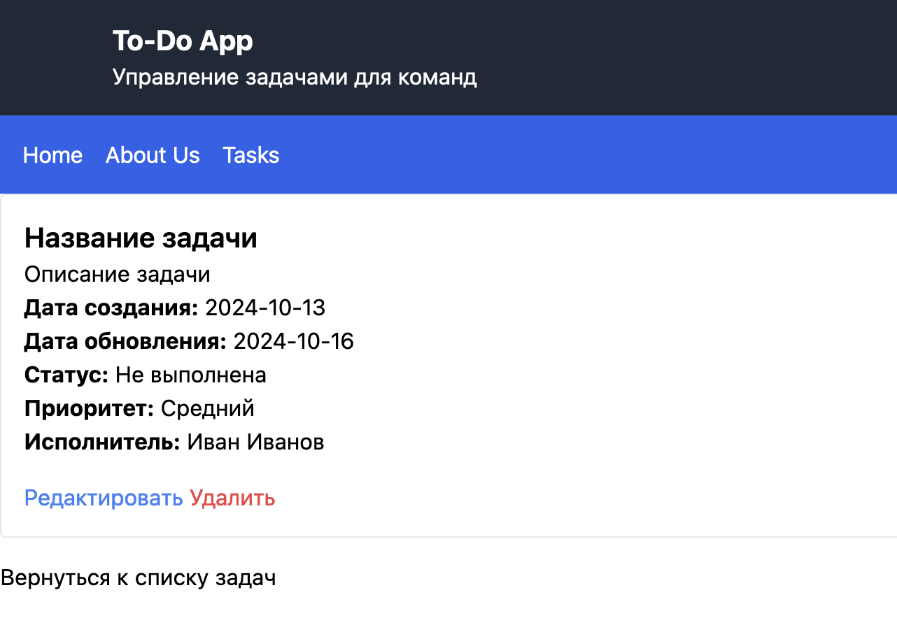

# Отчет по лабораторной работе: To-Do App для команд

## Описание проекта

To-Do App для команд — это веб-приложение для управления задачами внутри команды. С его помощью можно создавать задачи, назначать их участникам, устанавливать приоритеты и отслеживать статус выполнения. Приложение выполнено с использованием Laravel, Blade для шаблонизации и Tailwind CSS для стилизации.

---

## Выполненные задачи

### 1. Настройка проекта

- Установлен Laravel.
- Созданы базовые маршруты для главной страницы и страницы "О нас".

### 2. Создание маршрутов для задач

- Создан контроллер `TaskController` с методами:
  - `index` — отображение списка задач;
  - `create` — форма создания задачи;
  - `store` — сохранение задачи (оставлен пустым на данном этапе);
  - `show` — отображение отдельной задачи;
  - `edit` — форма редактирования задачи;
  - `update` — обновление задачи (оставлен пустым на данном этапе);
  - `destroy` — удаление задачи (оставлен пустым на данном этапе).
  

---

### 3. Шаблонизация с использованием Blade

- Создан макет страницы `layouts/app.blade.php`, который содержит общие элементы:
  - Заголовок;
  - Меню навигации;
  - Область для динамического контента с использованием директивы `@yield`.
  

- Созданы представления для страниц:
  - `home.blade.php` — главная страница с приветственным сообщением и навигацией;
  - `about.blade.php` — страница "О нас";
  - `tasks/index.blade.php` — список задач;
  - `tasks/show.blade.php` — отображение задачи с использованием статических данных.

---

### 4. Анонимные компоненты Blade

- Создан анонимный компонент для отображения заголовка `header`.
- Создан анонимный компонент для отображения задачи с параметрами:
  - Название задачи;
  - Описание;
  - Дата создания и обновления;
  - Статус выполнения;
  - Приоритет задачи;
  - Имя исполнителя.

---

### 5. Стилизация с использованием Tailwind CSS

- В файле `resources/views/layouts/app.blade.php` подключён файл стилей `public/css/app.css`.
- Все страницы приложения стилизованы с использованием Tailwind CSS.
- Кнопки, формы, заголовки, меню навигации стилизованы для улучшения UX/UI.

---
# Ответы на контрольные вопросы:

## 1. Что такое ресурсный контроллер в Laravel и какие маршруты он создает?

Ресурсный контроллер в Laravel — это специальный контроллер, который автоматически обрабатывает маршруты для стандартных операций CRUD (Create, Read, Update, Delete) на ресурсе. При создании ресурсного контроллера с помощью команды artisan, Laravel генерирует набор маршрутов, которые соответствуют методам контроллера:

- `GET /resource` — индекс (index) всех ресурсов
- `GET /resource/create` — форма для создания нового ресурса
- `POST /resource` — сохранение нового ресурса
- `GET /resource/{id}` — отображение конкретного ресурса
- `GET /resource/{id}/edit` — форма для редактирования ресурса
- `PUT/PATCH /resource/{id}` — обновление ресурса
- `DELETE /resource/{id}` — удаление ресурса

## 2. Объясните разницу между ручным созданием маршрутов и использованием ресурсного контроллера.

- **Ручное создание маршрутов**:
  - Каждый маршрут создается отдельно, что требует больше времени и усилий.
  - Можно легко настроить маршруты в соответствии с уникальными требованиями приложения.
  - Необходимо явно определять методы и действия для каждого маршрута.

- **Использование ресурсного контроллера**:
  - Позволяет сэкономить время за счет автоматической генерации стандартных маршрутов для CRUD.
  - Упрощает структуру кода и повышает читаемость.
  - Снижает вероятность ошибок, так как маршруты уже настроены для выполнения стандартных операций.

## 3. Какие преимущества предоставляет использование анонимных компонентов Blade?

- **Простота использования**: Анонимные компоненты позволяют быстро создавать компоненты без необходимости определять класс.
- **Легкость в настройке**: Они легко настраиваются и могут использоваться с различными параметрами.
- **Упрощение кода**: Уменьшается количество классов и файлов, что делает код более чистым и организованным.
- **Повышенная производительность**: Анонимные компоненты могут быть быстрее, так как они избегают необходимости загружать дополнительные классы.

## 4. Какие методы HTTP-запросов используются для выполнения операций CRUD?

- **Create**: `POST` — используется для создания нового ресурса.
- **Read**: 
- `GET` — используется для получения списка ресурсов (индекс) или конкретного ресурса.
- **Update**: `PUT` или `PATCH` — используется для обновления существующего ресурса.
- **Delete**: `DELETE` — используется для удаления ресурса.
---
## Вывод

В ходе лабораторной работы было создано простое веб-приложение для управления задачами внутри команды. Приложение реализует базовые CRUD-операции с задачами. С помощью Blade и Tailwind CSS был разработан интерфейс с современным дизайном и удобной навигацией.
